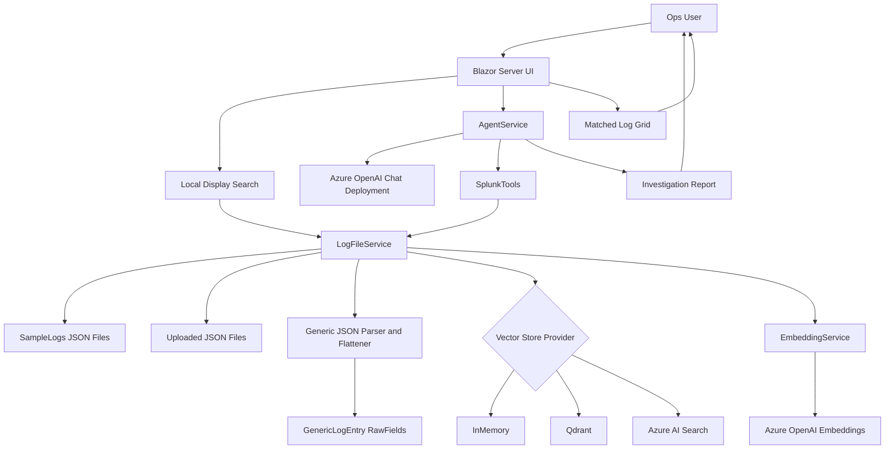
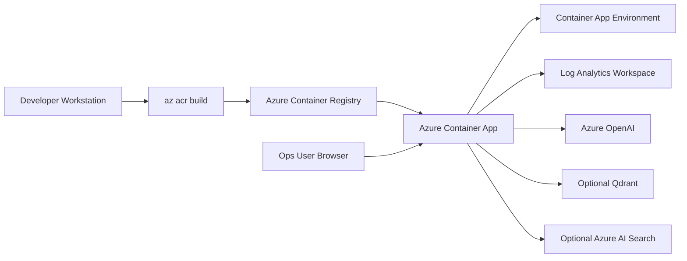

# High-Level Design

## 1. Overview

Splunk Investigator Agent is a Blazor Server application that helps operations teams investigate Splunk JSON exports using structured search, natural-language search, and AI-assisted analysis.

The application has five main layers:

1. Web UI
2. Agent orchestration
3. Tool layer
4. Log parsing and search
5. Vector search and AI services

## 2. High-Level Architecture



## 3. Container and Cloud Architecture



## 4. Logical Components

| Component | Responsibility |
|---|---|
| `Investigator.razor` | Chat UI, upload UI, matched log grid |
| `AgentService` | AI orchestration and streaming |
| `SplunkTools` | AI-callable investigation tools |
| `LogFileService` | JSON parsing, schema discovery, search, indexing |
| `GenericLogEntry` | Generic flattened log model |
| `EmbeddingService` | Builds embeddings for logs and user queries |
| `IVectorStoreService` | Vector store abstraction |
| `InMemoryVectorStoreService` | Default vector store |
| `QdrantVectorStoreService` | Optional Qdrant integration |
| `AzureAISearchVectorStoreService` | Optional Azure AI Search integration |

## 5. Data Model

Every log record is converted into:

```text
GenericLogEntry
  RawFields: Dictionary<string, string>
```

Nested fields are flattened:

```text
kubernetes.pod_name
kubernetes.labels.app
http.statuscode
trace.traceid
context.requestid
```

Reference fields are auto-detected by suffix:

```text
payment_ref
transfer_ref
loan_ref
*_ref
```

## 6. Search Behavior

The search system supports:

- Exact field search: `field=value`
- Natural field search: `where field is value`
- Free-text search across all field names and values
- Numeric value normalization
- Boolean value normalization
- Quoted values with spaces
- Light field typo handling

## 7. Security Design

Sensitive data is protected in AI and vector payloads by excluding high-risk identifier fields.

Searchable but sensitive-to-mask:

- Account numbers
- IBAN
- Card data
- User identifiers
- Contact data
- Passwords and credentials

Operational fields intentionally visible:

- Amount
- Currency
- Status
- Event
- Error code
- Service names
- Pod names
- Trace IDs

## 8. Availability and Fallback

If Qdrant or Azure AI Search is selected but unavailable:

1. Startup continues.
2. App logs a warning.
3. InMemory vector search is used.
4. Exact local search continues to work.

This keeps the ops workflow available even when optional vector infrastructure is down.
