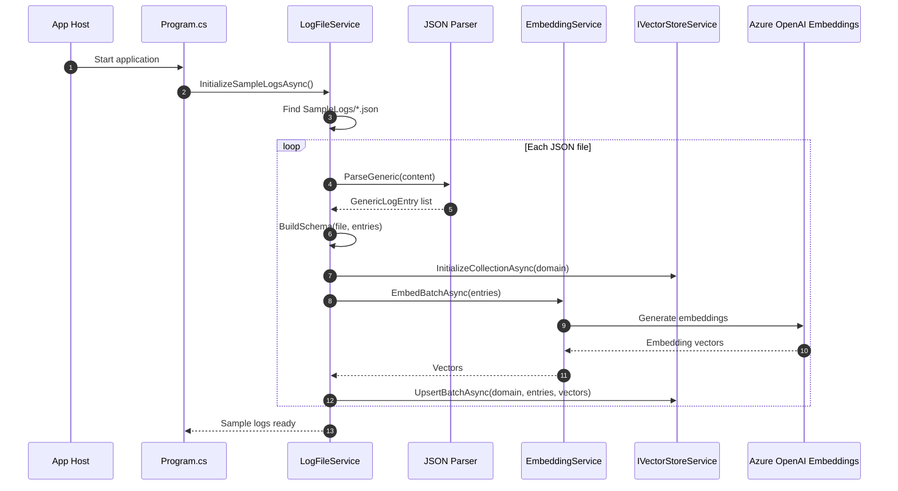
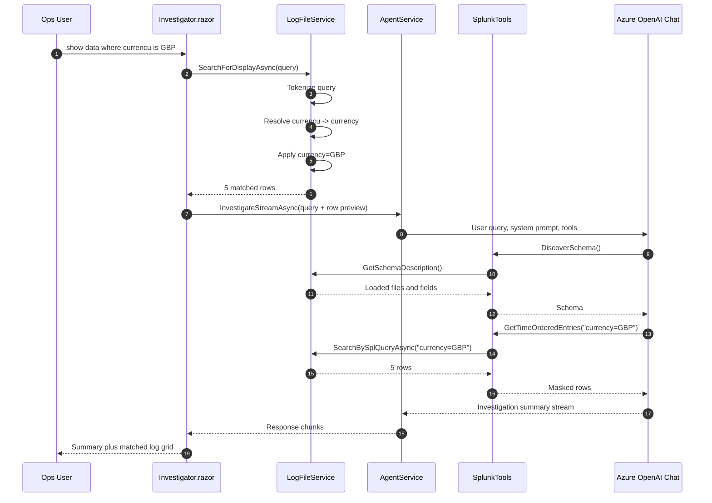
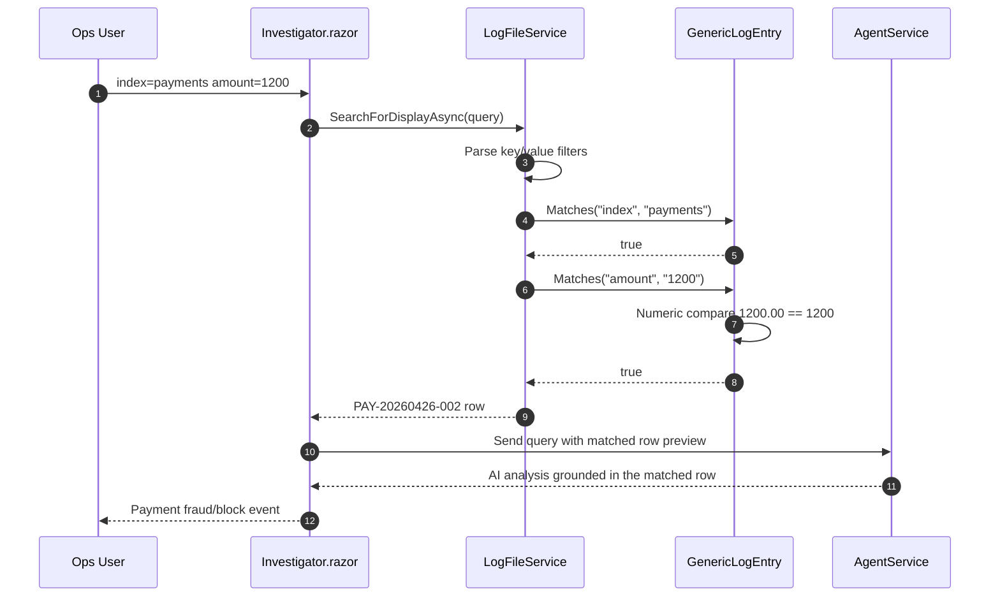
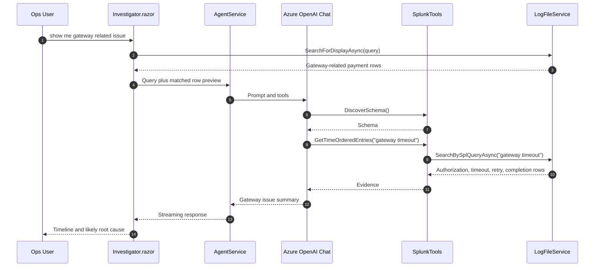
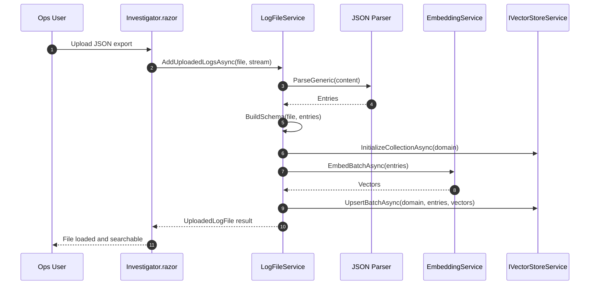
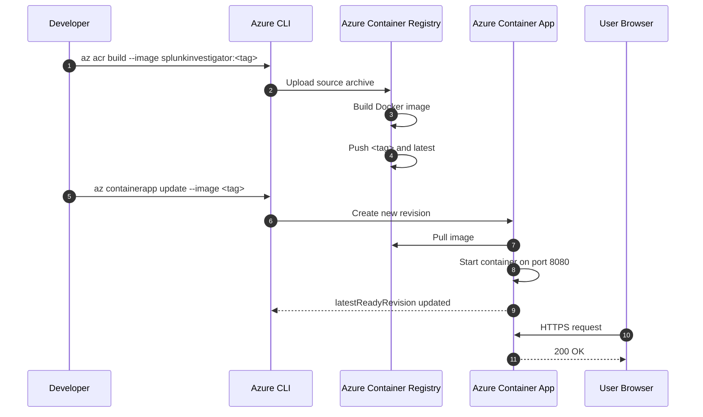

# Sequence Diagrams

## 1. Startup and Sample Log Indexing

## 2. Natural Search With Matched Grid

## 3. Exact Field Search

## 4. Gateway Issue Investigation

## 5. Upload Log File

## 6. Azure Deployment Flow

